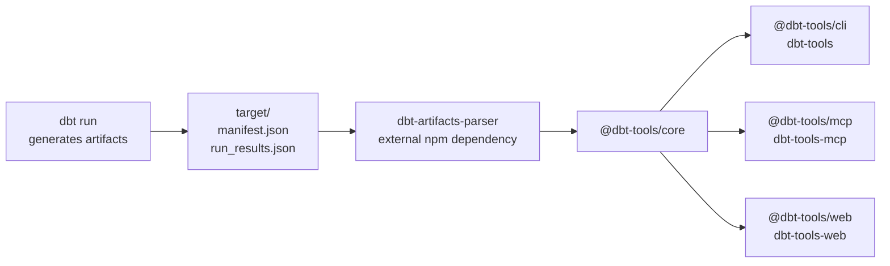

# dbt-tools-ts

TypeScript packages that turn `manifest.json`, `run_results.json`, and related dbt artifacts into **structured, deterministic operational intelligence** for operators and automation. The repository publishes `@dbt-tools/core`, `@dbt-tools/cli`, `@dbt-tools/mcp`, and `@dbt-tools/web`; parsing and artifact type definitions come from the external `dbt-artifacts-parser` npm package.

## Packages

| Package                                      | Path            | Description                                                                                                                    |
| -------------------------------------------- | --------------- | ------------------------------------------------------------------------------------------------------------------------------ |
| [`@dbt-tools/core`](packages/core/README.md) | `packages/core` | Analysis engine: graphs, execution analysis, snapshots, exports, and shared discovery logic.                                   |
| [`@dbt-tools/cli`](packages/cli/README.md)   | `packages/cli`  | CLI (`dbt-tools`) for machine-readable artifact analysis, schema introspection, field filtering, and agent-friendly workflows. |
| [`@dbt-tools/mcp`](packages/mcp/README.md)   | `packages/mcp`  | Long-lived MCP server (`dbt-tools-mcp`) with resident parsed artifact cache for interactive agent workflows.                   |
| [`@dbt-tools/web`](packages/web/README.md)   | `packages/web`  | Browser UI and local static server (`dbt-tools-web`) for dependency, execution, inventory, and health investigation.           |

## Architecture



Product positioning and package boundaries are recorded in [ADR-0008](docs/adr/0008-dbt-tools-operational-intelligence-and-positioning-boundaries.md). Remote artifact loading semantics are recorded in [ADR-0004](docs/adr/0004-remote-object-storage-artifact-sources-and-auto-reload.md).

## Quick Start

Install Node.js from [`.node-version`](.node-version), then install workspace dependencies:

```bash
pnpm install
```

Useful development commands:

```bash
pnpm build
pnpm test
pnpm dev:web
pnpm lint:report
pnpm coverage:report
pnpm knip
```

Run published-shaped tools after installation from npm:

```bash
npx @dbt-tools/cli status --dbt-target ./target
npx @dbt-tools/mcp --dbt-target ./target
npx @dbt-tools/web --target ./target
```

## Relationship to dbt-artifacts-parser

`@dbt-tools/*` packages depend on `dbt-artifacts-parser` for all artifact parsing and type definitions. This repository owns the analysis, CLI, and web layers; it does not generate or publish parser schemas. Parser repository references should remain only when they explicitly describe that external package.

## License

The `@dbt-tools/*` packages use a custom source-available license; they are not OSI open source. See [`LICENSES/README.md`](LICENSES/README.md) for the repository license map and [`packages/LICENSE`](packages/LICENSE) for the binding package terms. Dependencies such as `dbt-artifacts-parser` remain under their own licenses.
