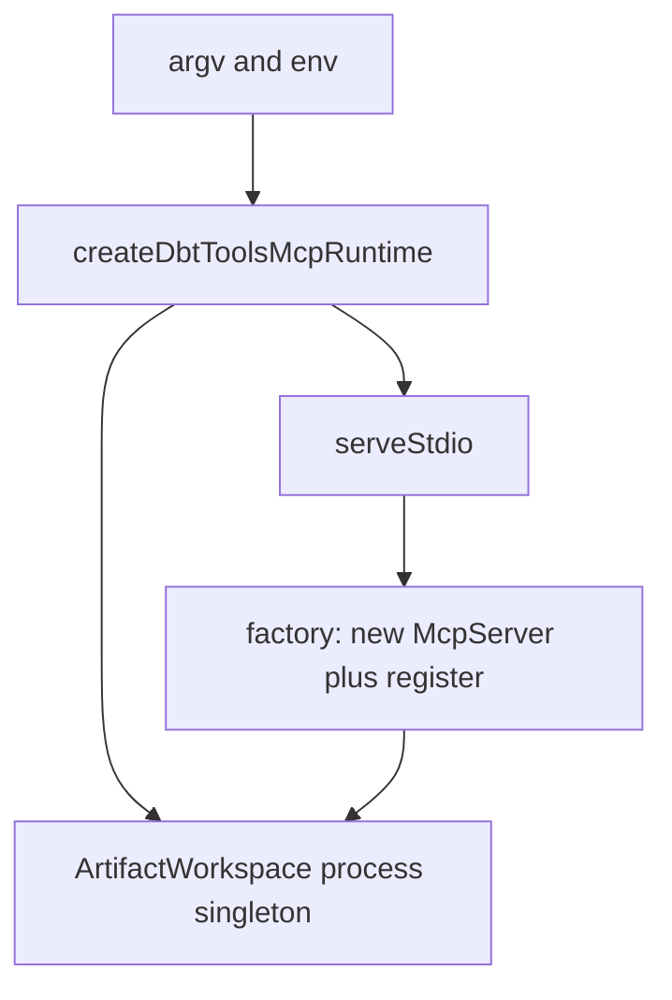

# ADR-0016: MCP SDK v2 dual-era stdio without HTTP

## Status

Accepted

## Context

Coding-agent hosts spawn `@dbt-tools/mcp` as a stdio child (`npx @dbt-tools/mcp`). The TypeScript MCP SDK split into v2 packages (`@modelcontextprotocol/server` / `client`) and the protocol revision `2026-07-28` dropped the `initialize` handshake for a `server/discover` / per-request `_meta` era.

SDK v2 does **not** put `2026-07-28` on the wire by default: `McpServer.connect(StdioServerTransport)` still speaks the 2025-era handshake. Serving both eras requires `serveStdio(factory)` with default `legacy: 'serve'`. A `server/discover` probe may construct a server instance and discard it if the client then sends `initialize`, so factories must be cheap and must not own process-level artifact state.

ADR-0012 deferred Streamable HTTP, OAuth, roots, and resource subscriptions. ADR-0015 T7 is stdio-only product v1 (read-only tools, schema validation)—not a freeze on MCP protocol year.

## Decision

1. **`@dbt-tools/mcp` uses MCP TypeScript SDK 2.0** (`@modelcontextprotocol/server`) and serves MCP over **stdio only**.
2. **Dual-era stdio:** `serveStdio(() => buildServer(runtime))` with default `legacy: 'serve'`. Modern (`2026-07-28`) when the host negotiates it; 2025-era `initialize` for current coding-agent hosts. Do not set `legacy: 'reject'`.
3. **Process-level `ArtifactWorkspace` lives outside the factory.** Parse argv, construct the workspace, start refresh polling, and create handlers once. The factory only constructs `McpServer` and registers tools/resources/prompts, closing over that runtime. Probe-then-fallback must not leak pollers or reset `set_target`.
4. **Product JSON contracts stay unchanged** (ADR-0012): tool names, successful tool JSON, and `dbt-tools://` envelopes.
5. **Streamable HTTP, OAuth, MCP roots, and resource subscriptions remain deferred** (ADR-0012). Adding a network listener requires a new ADR that supersedes this record and updates [docs/security/threat-model.md](../security/threat-model.md).

## Consequences

- Hosts that still speak 2025-era `initialize` keep working; hosts that pin `2026-07-28` connect without a second server binary.
- `pnpm smoke:mcp` must cover both eras (legacy default client and modern pin). `mode: 'auto'` is not a sufficient modern check because stdio auto can fall back.
- T7 remains stdio-only + schema validation. The SDK major bump is a dependency change under ADR-0015's threat-model update policy, not a new listener.
- Plugin spawn config (`plugins/dbt-tools-mcp/mcp.json`) stays command/args; no URL transport.

## Related

- [ADR-0012](0012-protocol-native-mcp-resources-prompts-and-output-schemas.md) — resources, prompts, output schemas; HTTP/OAuth still deferred
- [ADR-0015](0015-threat-model-controls.md) — T7 stdio-only product v1
- [docs/security/threat-model.md](../security/threat-model.md)
- [packages/mcp/README.md](../../packages/mcp/README.md)
