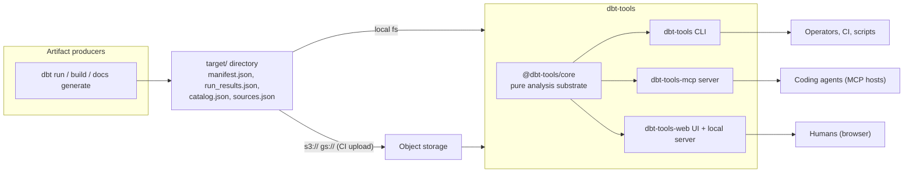
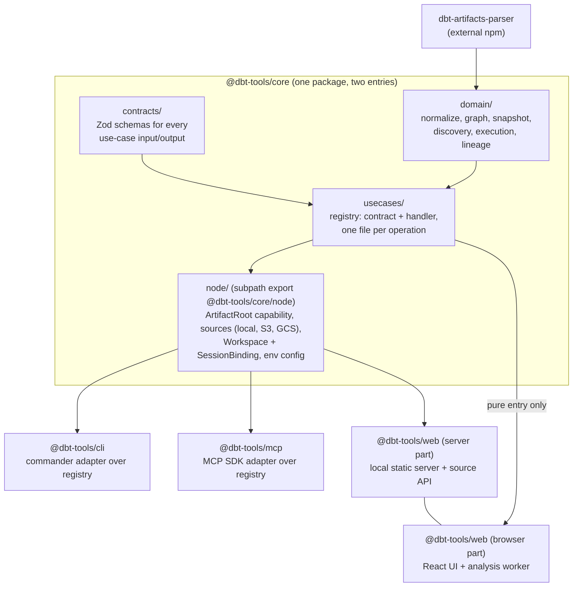
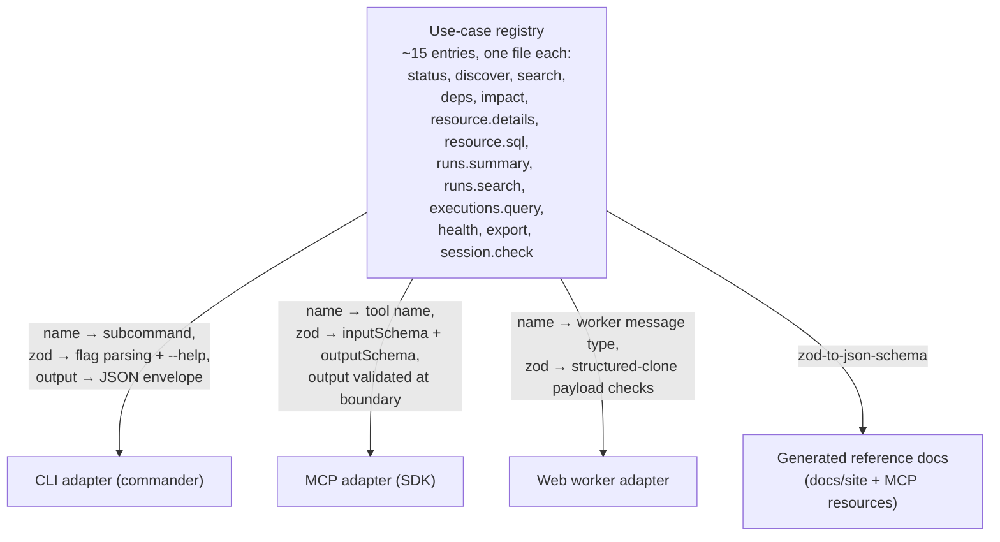
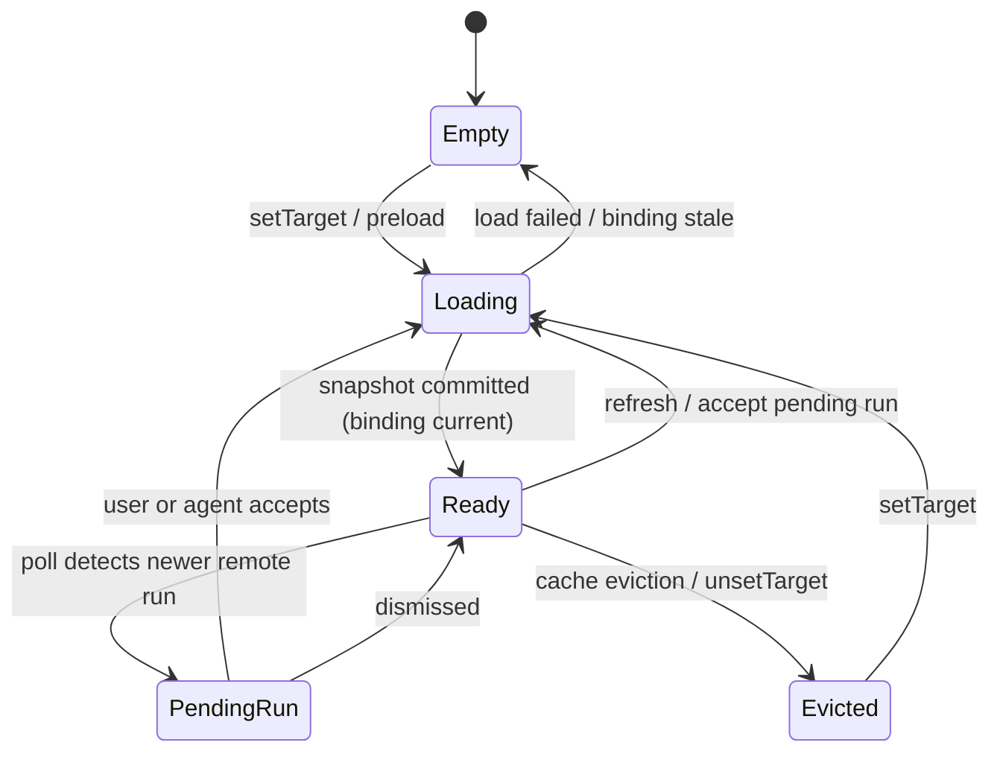
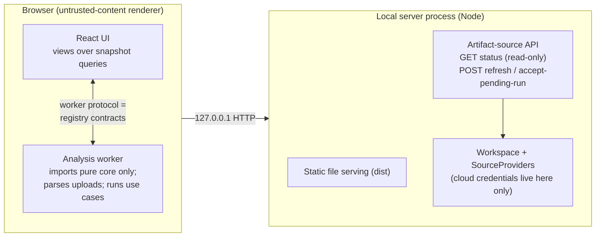
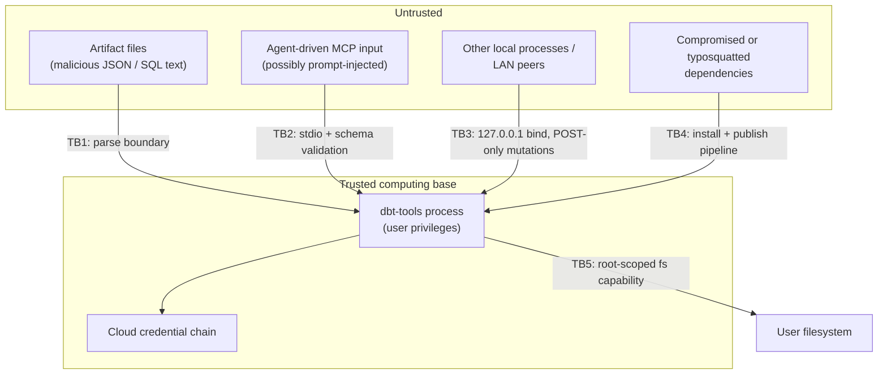
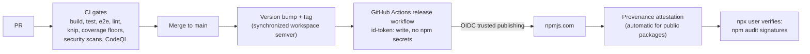
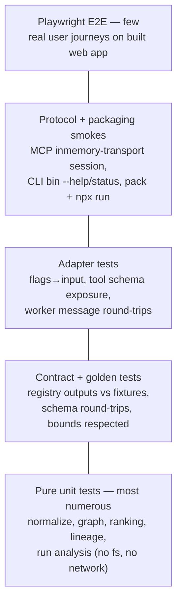

# RFC-0001: Clean-slate redesign of dbt-tools — architecture, security, and governance

| Field        | Value                                                                                              |
| ------------ | -------------------------------------------------------------------------------------------------- |
| **Status**   | Proposed                                                                                           |
| **Date**     | 2026-07-04                                                                                         |
| **Scope**    | Whole repository: package layout, core design, CLI/MCP/web surfaces, security, governance, testing |
| **Replaces** | Nothing (design-restart thought experiment; current ADRs remain in force until superseded)         |

## 1. Summary

If dbt-tools were reimplemented from scratch today, we would keep its validated product shape — a **deterministic, artifact-first operational-intelligence layer** with one analysis substrate serving a CLI, an MCP server, and a local web UI — and change **how the code is layered and how cross-surface behavior is defined**.

The redesign rests on four ideas, each chosen to make the system easier to maintain, test, and extend **without adding infrastructure**:

1. **Purity inversion in core.** The default `@dbt-tools/core` entry becomes pure and browser-safe (no Node built-ins, no cloud SDKs). Everything that touches the filesystem, network, or environment lives behind one explicit Node-only boundary. Today the arrangement is inverted (Node-flavored default entry plus a `browser` facade), and keeping the facade honest requires ongoing discipline.
2. **A use-case registry as the single cross-surface contract.** Every operation (status, discover, dependencies, impact, run summary, execution search, resource details, export, …) is defined **once** as a Zod input/output contract plus one handler. CLI commands, MCP tools, and the web worker protocol become thin generated adapters over the same registry, so the three surfaces cannot drift.
3. **Security by construction, not by call-site review.** Path containment, payload bounds, and prototype-pollution safety are enforced by the types handed to the domain layer (a root-scoped filesystem capability, bounded output envelopes, `Map`-based collections), rather than by asking every call site to remember a validation helper.
4. **Governance as pipeline, not policy prose.** Supply-chain posture (lockfile-only installs, no lifecycle scripts, OIDC trusted publishing with provenance), license clarity, and the ADR/RFC record are wired into CI so they cannot silently regress.

Everything else — graphology for graphs, `dbt-artifacts-parser` as the external parsing dependency, Vitest/Playwright, pnpm workspace, four published packages — is retained deliberately. This RFC explains the target design in detail, grounds each security decision in the official guidance for the underlying technology, and ends with an incremental implementation plan and an explicit list of things we refuse to build.

## 2. Motivation

### 2.1 What the current implementation got right

The existing repository (~40k lines of TypeScript across four packages, 12 ADRs) validated several decisions this RFC keeps as axioms:

- **Artifact-first determinism** ([ADR-0008](../adr/0008-dbt-tools-operational-intelligence-and-positioning-boundaries.md)): all intelligence derives from `manifest.json`, `run_results.json`, and friends; no live warehouse access, no LLM dependency in the product itself.
- **External parser boundary**: `dbt-artifacts-parser` owns schema types and version dispatch; this repo owns analysis and surfaces.
- **One substrate, three surfaces**: `@dbt-tools/core` feeding `cli`, `mcp`, and `web` matches how operators and coding agents actually consume the tool.
- **Backend-owned remote access** ([ADR-0004](../adr/0004-remote-object-storage-artifact-sources-and-auto-reload.md)): cloud credentials never reach the browser.
- **Contracts in Zod** ([ADR-0012](../adr/0012-protocol-native-mcp-resources-prompts-and-output-schemas.md)) and a shared discovery ranker ([ADR-0010](../adr/0010-shared-discovery-ranker-intent-commands-and-cli-web-deep-links.md)).
- **OIDC trusted publishing** ([ADR-0009](../adr/0009-npm-releases-authenticate-via-github-actions-oidc-trusted-publishing.md)).

### 2.2 What accreted, and what it costs

Growth happened feature-by-feature, so several cross-cutting concerns exist as **parallel implementations discovered after the fact**:

| Symptom                                          | Evidence                                                                                                                                                              | Cost                                                                                                               |
| ------------------------------------------------ | --------------------------------------------------------------------------------------------------------------------------------------------------------------------- | ------------------------------------------------------------------------------------------------------------------ |
| Three surfaces hand-wire the same operations     | CLI actions (`packages/cli/src/actions`), MCP tool handlers (`packages/mcp/src/tools`), and web workers each call core independently and shape their own envelopes    | Parity bugs; every new operation is implemented three times; MCP `outputSchema` had to be retrofitted (ADR-0012)   |
| Session/staleness logic was invented three times | ADR-0011 documents unifying `loadGeneration`, `sessionGeneration`, and `activeLoadGeneration` into `SessionBinding` after the fact                                    | Concurrency bugs found in production paths; the unified helper is adopted by convention, not by construction       |
| Browser/Node split is a facade, not a boundary   | `core/browser.ts` re-exports a safe subset of a Node-flavored package; workers must remember to import the right entry                                                | A single wrong import breaks the web worker build; lint has to police what the module graph should make impossible |
| Path-safety is per-call-site                     | `safe-fs.ts` wraps `node:fs` and every dynamic path "must go through `resolveSafePath` first" (AGENTS.md policy) with an ESLint layer as backstop                     | Correct today, but the invariant lives in review discipline plus lint suppressions rather than in the type system  |
| Two workspace implementations                    | MCP `ArtifactWorkspace` (target cache, TTL eviction, refresh) and web `ArtifactSourceService` (preload, poll, accept-pending-run) solve the same lifecycle separately | Duplicate state machines to test and keep consistent                                                               |

None of these are emergencies. They are exactly the seams a from-scratch design would place differently, which is what this RFC does.

### 2.3 Goals

1. **Security- and governance-aware by default**: threat model written down; every control traceable to official guidance; supply chain verifiable end to end.
2. **Easy to maintain**: one definition per operation; module boundaries enforced by the dependency graph, not by convention.
3. **Easy to test**: a pure core testable without filesystem or network; contract tests generated from the same schemas the surfaces use.
4. **Easy to extend**: adding a use case, an artifact-source provider, or a warehouse adapter each has a one-file recipe.
5. **Simple**: no new infrastructure, no plugin framework, no daemon, no database. Fewer moving parts than today where possible.

### 2.4 Non-goals

- No product repositioning: dbt-tools remains artifact-first operational intelligence (ADR-0008 pillars stand).
- No rewrite of `dbt-artifacts-parser` or schema generation; that stays upstream.
- No hosted/multi-tenant service, no auth server, no live warehouse connectivity.
- No commitment to migrate the current codebase wholesale; §12 describes an incremental path and the option to adopt only slices.

## 3. Grounding in official references

Design and security decisions below cite these primary sources (checked 2026-07):

| Topic            | Source                                                                                                                                          | Facts this RFC relies on                                                                                                                                                                                                                                                           |
| ---------------- | ----------------------------------------------------------------------------------------------------------------------------------------------- | ---------------------------------------------------------------------------------------------------------------------------------------------------------------------------------------------------------------------------------------------------------------------------------- |
| dbt artifacts    | [dbt artifacts reference](https://docs.getdbt.com/reference/artifacts/dbt-artifacts), [schemas.getdbt.com](https://schemas.getdbt.com/)         | Five artifacts (manifest, run results, catalog, sources, semantic manifest); each carries `metadata.dbt_schema_version`; schemas are versioned independently (manifest v12, run-results v6, catalog v1, sources v3 at time of writing) and **may change in any dbt minor release** |
| MCP              | [MCP specification 2025-06-18, Security Best Practices](https://modelcontextprotocol.io/specification/2025-06-18/basic/security_best_practices) | Token passthrough is forbidden; sessions must not be used for authentication; session IDs must be secure and non-deterministic; local servers should prefer `stdio` transport to limit access to the client; scope minimization guidance                                           |
| Node.js security | [Node.js official security best practices](https://nodejs.org/en/learn/getting-started/security-best-practices)                                 | Named mitigations for path traversal, prototype pollution (CWE-1321), DoS (CWE-400) timeouts/limits, supply-chain attacks (lockfiles, `npm ci`, `--ignore-scripts`, release-age cooldown), permission model (`--permission`)                                                       |
| npm supply chain | [npm trusted publishing](https://docs.npmjs.com/trusted-publishers)                                                                             | OIDC-based publishing replaces long-lived tokens; provenance attestations are generated automatically for public packages published from GitHub Actions                                                                                                                            |
| Frameworks       | Zod v4, graphology (+`graphology-dag`), commander, `@modelcontextprotocol/server`, Vite/React 19, Vitest 4, Playwright                          | Already in use; retained (see §11 Alternatives)                                                                                                                                                                                                                                    |

Two consequences of the dbt facts shape the whole design:

- **Schema volatility is a first-class requirement.** Because artifact schemas can change in minor dbt releases, the parser dependency (which dispatches on `dbt_schema_version`) is the only place raw artifact types may appear. Everything downstream consumes a **normalized model owned by this repo**, so a manifest v13 lands as a parser upgrade plus normalization patch — not a repo-wide type migration.
- **Artifacts are untrusted input.** A manifest is arbitrary attacker-controllable JSON the moment a user opens artifacts from a repo they didn't produce (or uploads a file into the web UI). Parsing, normalization, and rendering must treat it accordingly (§7).

## 4. Proposed architecture

### 4.1 System context



Unchanged from today at this altitude. Every change in this RFC is **inside** the `dbt-tools` box.

### 4.2 Package and layer design

Four published packages are kept. The redesign changes what lives where and which imports are legal:



**Dependency rules (enforced, not advisory):**

| Layer                        | May import                                                                 | Must never import             |
| ---------------------------- | -------------------------------------------------------------------------- | ----------------------------- |
| `contracts/`                 | Zod only                                                                   | anything else                 |
| `domain/`                    | `contracts/`, graphology, `node-sql-parser`, parser types                  | `node:*`, cloud SDKs, `node/` |
| `usecases/`                  | `contracts/`, `domain/`                                                    | `node:*`, cloud SDKs          |
| `node/`                      | everything above + `node:*`, `@aws-sdk/client-s3`, `@google-cloud/storage` | UI code                       |
| `cli`, `mcp`, web server     | `core` + `core/node`                                                       | each other                    |
| web browser code and workers | `core` (pure entry) only                                                   | `core/node`                   |

The enforcement mechanism is structural: the package's default export map points at the pure build, `core/node` is a separate subpath, and a single ESLint `import-x/no-restricted-paths` rule (plus `knip`) verifies the layer table. This inverts today's arrangement — **browser-safety is the default and Node access is the opt-in** — so the web worker cannot accidentally pull in `node:fs` or a cloud SDK; the import simply does not resolve.

**Simplicity note.** We considered splitting `core` into two packages (`core` + `runtime`). Rejected: one more version to sync, one more README, no additional safety beyond what the export map already gives. Subpath exports achieve the same boundary inside one package.

### 4.3 The domain model

The domain layer owns a small, stable vocabulary. Raw parser output is confined to the normalization step:

```mermaid
flowchart LR
  raw["Raw artifacts (untrusted JSON)"] --> parse["dbt-artifacts-parser<br/>version dispatch via<br/>metadata.dbt_schema_version"]
  parse --> norm["normalize()<br/>owns schema-version drift"]
  norm --> snap["ArtifactSnapshot (immutable)"]
  subgraph snapContents["ArtifactSnapshot"]
    nodesIdx["resources: Map(uniqueId → ResourceNode)"]
    graph["ManifestGraph (graphology DAG)<br/>+ direct-dependency index"]
    runs["executions: RunRecord[] + adapter metrics"]
    meta["provenance: dbt version, schema versions,<br/>generated_at, invocation_id, versionToken"]
  end
  snap --> analyses["Pure analyses:<br/>discovery ranking, impact/build order,<br/>run summary and search, field lineage,<br/>health checks, exports"]
```

Durable properties (carried over from ADR-0002/0003/0006/0010 and made explicit):

- **`ArtifactSnapshot` is immutable and cheap to hold.** Heavy payloads (compiled SQL, long descriptions) are stored behind lazy accessors; snapshot-level previews carry direct-neighbor context only, never whole-graph reachability totals.
- **One graph substrate.** Model-, source-, and field-level nodes share the graphology DAG vocabulary; field lineage (AST-inferred from compiled SQL, catalog-refined, model-level fallback) extends the same graph rather than forming a parallel structure.
- **Provenance travels with every answer.** Each use-case output embeds the snapshot `versionToken` and generation metadata so agents and humans can detect stale answers — this is what makes determinism auditable.
- **Collections are `Map`s, never record-typed objects indexed by artifact-controlled strings** (see §7.3 on prototype pollution).

### 4.4 The use-case registry (the core maintainability change)

Every operation the product exposes is one value of one type:

```ts
// usecases/types.ts (illustrative)
interface UseCase<In, Out> {
  name: string; // e.g. "resource.dependencies"
  title: string;
  input: z.ZodType<In>; // from contracts/
  output: z.ZodType<Out>; // from contracts/; includes bounds + truncation markers
  read: 'snapshot'; // all v1 use cases are read-only over a snapshot
  run(snapshot: ArtifactSnapshot, input: In): Out; // pure, synchronous
}
```

and the surfaces are **adapters generated from the registry**:



Consequences:

- **Parity is structural.** A new operation is one file (contract + handler + tests). It appears in the CLI, the MCP tool list with `outputSchema`, the worker protocol, and the reference docs without further wiring. ADR-0010's `reasons` / `next_actions` / `primitive_commands` and deep-link fields live in the shared output contracts, so explainability is uniform too.
- **Surface-specific shape stays in the adapter.** Warehouse-specific execution filter/sort shapes (a recorded user preference) are expressed as per-adapter discriminated unions **in the contract**, so the CLI flag layout and MCP tool schema derive from the same union rather than a flat option bag.
- **Testing collapses.** Contract round-trip tests and golden-fixture tests run against the registry once; adapter tests only verify translation (flags → input, output → envelope), not analysis behavior.
- **Not a framework.** The registry is an array of objects and three ~100-line adapters. No decorators, no DI container, no code generation step beyond `zod-to-json-schema` for docs.

Use cases are synchronous and pure over a snapshot. Loading, refreshing, and caching snapshots is the workspace's job (§4.5) — keeping the two concerns apart is what makes the registry this small.

### 4.5 One workspace, one session model

A single `Workspace` implementation in `core/node` serves both long-lived surfaces (MCP server, web local server). It owns the artifact-source lifecycle that MCP's `ArtifactWorkspace` and web's `ArtifactSourceService` implement separately today:

```mermaid
sequenceDiagram
  participant S as Surface (MCP server / web server)
  participant W as Workspace (core/node)
  participant P as SourceProvider (local | s3 | gcs)
  participant D as Domain (pure)

  S->>W: setTarget(location)
  W->>W: binding = capture(epoch+1, scopeKey)
  W->>P: discover() + fetch bytes (bounded)
  P-->>W: artifact bytes + run version
  W->>W: still current? (binding check after every await)
  W->>D: parse + normalize + snapshot
  D-->>W: ArtifactSnapshot(versionToken)
  W->>W: still current? then commit; else discard
  W-->>S: status(versionToken, provenance)
  S->>W: run(useCase, input)
  W->>D: useCase.run(snapshot, input)
  D-->>S: output (validated, bounded, versionToken)
```

- **`SessionBinding` is the only staleness mechanism** (epoch + scope key, checked after every `await`), exactly as ADR-0011 concluded — but here new surfaces get it by using `Workspace`, not by remembering to copy a pattern.
- **Bounded cache** of parsed targets (default 3, configurable, TTL-evictable) carries over from the current MCP design; the web server uses the same cache with size 1.
- **`SourceProvider` is the extension interface** for artifact origins: `local` (root-scoped directory), `s3`, `gs`. Each provider is constructed at startup from validated config; providers are the only code holding cloud clients.

State machine for a target (identical for MCP and web, which is the point):



### 4.6 Surface designs

**CLI (`@dbt-tools/cli`, bin `dbt-tools`).** Stateless, one-shot: resolve config → construct `Workspace` → load once → run use case → print JSON envelope (`data`/`error` + provenance) → exit non-zero on error. Human-readable rendering is a formatting flag over the same envelope, never a second data path. Manifest-only readiness (`check-session`) remains CLI-only, matching the recorded preference that MCP always loads manifest + run results together.

**MCP (`@dbt-tools/mcp`, bin `dbt-tools-mcp`).** `stdio` transport only in v1 (per MCP security best practices for local servers, §7.4). Tools, `dbt-tools://` resources, resource templates, and prompts are all derived from the registry and contracts (ADR-0012 carried forward). Workspace-control tools (`set_target`, `unset_target`, `refresh`, `clear_cached_targets`) are the only stateful surface and map 1:1 to `Workspace` methods. Output validation at the boundary stays on by default.

**Web (`@dbt-tools/web`, bin `dbt-tools-web`).** Three runtime contexts with different privileges:



- Upload mode parses entirely in the worker: bytes never leave the browser.
- Local-preload and remote modes go through the server's `Workspace`; the browser sees artifact bytes or snapshot data, **never provider credentials or raw remote URIs beyond what the user configured** (ADR-0004 invariant, kept).
- Reads are `GET` and side-effect-free; every mutation is a `POST` (ADR-0011's split, kept and generalized).

## 5. Configuration and naming

- All product configuration uses the **`DBT_TOOLS_` prefix** with a single resolution module in `core/node` (flag > env > default), one table in the reference docs generated from the same definition. Legacy `DBT_*` fallbacks are dropped in the clean-slate design (the migration window ADR-0004 allowed is over).
- Target locations are **location-oriented** (`./target`, `s3://bucket/prefix`, `gs://bucket/prefix`) with one parser for all surfaces.
- Secrets are never accepted as flags (visible in `ps`/shell history); cloud credentials come exclusively from the standard SDK provider chains (AWS/GCP default credential discovery), and dbt-tools never persists them.

## 6. Threat model

Assets, in rough order of value:

1. **The user's machine and account** — CLI/MCP/web-server all run with the invoking user's privileges.
2. **Cloud credentials** in the server process environment (S3/GCS provider chains).
3. **Artifact contents** — manifests can embed schema/table names, SQL, and business logic that may be confidential.
4. **Integrity of the published packages** — four npm packages executed via `npx` by strangers.

Trust boundaries and adversaries:



| #   | Threat                                                                                    | Vector                                      | Primary control (§7)                                                                           |
| --- | ----------------------------------------------------------------------------------------- | ------------------------------------------- | ---------------------------------------------------------------------------------------------- |
| T1  | Path traversal / arbitrary file read via crafted target paths or artifact-internal paths  | CLI flags, MCP `set_target`, web source API | `ArtifactRoot` capability (§7.2)                                                               |
| T2  | Prototype pollution from hostile artifact JSON                                            | `manifest.json` keys like `__proto__`       | Null-prototype parsing + `Map` collections + Zod validation (§7.3)                             |
| T3  | Resource exhaustion (huge or deeply nested artifacts, unbounded query outputs)            | Any surface                                 | Size caps, parse limits, bounded output envelopes, server timeouts (§7.5)                      |
| T4  | Stored XSS in the web UI from artifact-sourced strings (descriptions, SQL, markdown docs) | Rendering untrusted artifact text           | React escaping discipline + sanitized markdown + CSP (§7.6)                                    |
| T5  | Session confusion / stale-snapshot answers presented as current                           | Concurrent loads, remote polling            | `SessionBinding` in one `Workspace` (§4.5)                                                     |
| T6  | Abuse of the local web server by other local processes or LAN peers (DNS rebinding-style) | HTTP to the local server                    | Loopback bind default, Host/Origin checks, no credential exposure (§7.4)                       |
| T7  | MCP-specific abuse: token passthrough, guessable sessions, over-broad capability          | MCP clients                                 | stdio-only v1; no auth tokens accepted or forwarded; read-only tool surface (§7.4)             |
| T8  | Supply-chain compromise of our dependencies or of our published packages                  | npm ecosystem                               | Lockfile + `--ignore-scripts` + cooldown + scanners; OIDC publishing + provenance (§8.1)       |
| T9  | Credential leakage into browser, logs, or artifacts of this repo                          | Remote sources, debug output                | Server-side-only providers; structured logging with redaction; secrets policy in CI (§7.7, §8) |

Out of scope (accepted risks, documented for honesty): a malicious dbt project attacking the _user who runs dbt_ (that is dbt's trust model, upstream of us); an attacker with the user's own privileges on the machine (nothing we do survives that); side-channel-grade confidentiality between local processes.

## 7. Security design

Each control below cites the guidance it implements.

### 7.1 Posture: read-only by construction

The entire v1 product **never writes** to user data. Use cases are pure functions over immutable snapshots; the only writes the process performs are explicit exports to a user-chosen output path (CLI `export --out`) and its own temp directories. This single property eliminates whole classes of consequence: T1 becomes read-scope containment, T7 loses its scariest outcome. The `UseCase.read: "snapshot"` field is not decorative — an adapter refuses to register anything else, so a future writable operation forces a deliberate design conversation (and an ADR).

For defense in depth, docs recommend (and CI smoke-tests) running the published binaries under the **Node.js permission model** — `node --permission --allow-fs-read=<target-dir>` — which the official Node.js guidance positions precisely for containing compromised-dependency impact.

### 7.2 Filesystem: a root capability instead of validated call sites

Today: every dynamic path must remember to call `resolveSafePath`, with ESLint hunting violations. Clean-slate: paths are unrepresentable outside the boundary.

```ts
// core/node — the only module that touches node:fs with dynamic paths
class ArtifactRoot {
  private constructor(private readonly realRoot: string) {}
  static open(candidate: string): ArtifactRoot; // realpath + containment check, throws otherwise
  read(rel: RelPath): Promise<Uint8Array>; // joins, re-verifies containment after resolution, enforces size cap
  list(rel: RelPath): Promise<Entry[]>;
}
```

- `ArtifactRoot.open` canonicalizes with `realpath` (symlinks resolved **before** the containment check, closing the classic symlink-swap gap) and every `read` re-verifies the joined path is inside the root.
- Domain and use-case code never see strings-as-paths; they receive bytes or an `ArtifactRoot`. There is no `fs` import to misuse, so the `security/detect-non-literal-fs-filename` suppression shrinks from a package-wide preamble to this one file.
- Remote providers get the mirror-image treatment: an `ObjectPrefix` capability that only permits `GET`/`LIST` under the configured bucket+prefix, with response size caps.

This implements the Node.js guidance on path traversal and uncontrolled search paths by **construction**, which is cheaper to maintain than per-call review — the review surface is one class.

### 7.3 Untrusted JSON: prototype pollution and schema validation

Artifacts are attacker-controllable JSON (§3). Following the official Node.js CWE-1321 guidance:

- All artifact parsing goes through one `parseUntrustedJson` helper that revives objects **without prototypes** (`Object.create(null)` semantics) before anything else touches the data.
- Normalized collections are **`Map`s keyed by artifact strings** — never plain objects indexed by `unique_id`/names — so `__proto__`, `constructor`, and `prototype` keys are inert data. (The current repo's `typed-map.ts` policy generalizes into the default.)
- Zod validation runs at both edges: artifact metadata on the way in (before trusting `dbt_schema_version` for parser dispatch), and use-case outputs on the way out (MCP boundary validation kept from ADR-0012).
- The web upload path applies the same helper inside the worker, so browser-parsed artifacts get identical treatment.

### 7.4 Serving surfaces: MCP and the local web server

**MCP**, per the MCP 2025-06-18 security best practices:

- **`stdio` transport only in v1.** The spec's local-server guidance is explicit: prefer stdio to limit access to the connected client. Streamable HTTP + OAuth stays deferred (as ADR-0012 already chose); if it ever lands, the spec's requirements come with it as acceptance criteria: no token passthrough (only tokens issued **to** this server), secure random session IDs bound to user identity, sessions never used as authentication.
- **No secrets in tool space.** No tool accepts or returns credentials; target locations are the most sensitive input and they route through `ArtifactRoot`/`ObjectPrefix` validation.
- **Capability minimalism** as the analog of scope minimization: the tool surface is read-only analysis plus workspace control; there is no "run shell", no "write file", no eval-shaped tool for an injected prompt to leverage. Tool descriptions state this so hosts can render honest consent.

**Local web server**, per Node.js DoS/DNS-rebinding guidance:

- Binds `127.0.0.1` by default; binding non-loopback requires an explicit flag that also prints a warning. Requests must carry a `Host` header matching the bound address (mitigates DNS-rebinding against the API) and mutating endpoints reject cross-origin `Origin` headers.
- Standard timeouts (`headersTimeout`, `requestTimeout`) and a request body size cap are set explicitly; upload endpoints enforce per-artifact byte limits before buffering.
- The server never proxies arbitrary URLs (no SSRF surface): remote fetches only go through configured `SourceProvider`s whose bucket/prefix was fixed at startup.

### 7.5 Bounded outputs everywhere

Every output contract carries explicit bounds: max items, max SQL bytes, truncation markers with "how to get more" hints (`next_actions`). This is simultaneously a UX feature for agents (predictable context cost), a performance invariant (ADR-0003's lazy-SQL rule generalized), and the DoS control for T3. Bounds live in `contracts/` so all surfaces enforce identical limits.

### 7.6 Rendering untrusted text in the browser

Artifact strings (descriptions, docs, SQL) may be hostile (T4):

- React's default escaping is the baseline; `dangerouslySetInnerHTML` is banned by lint.
- Markdown rendering (`react-markdown`) runs with raw HTML disabled — plugins that enable `rehype-raw` are rejected in review.
- The served `index.html` sets a strict CSP (`default-src 'self'`; no inline script) — cheap because the app is fully self-contained by design.

### 7.7 Logging and diagnostics

One structured logger in `core/node` with redaction of known-sensitive keys (env values, provider config) and a hard rule: **log locations and identifiers, never artifact payloads** at default level. Debug dumps that include payloads require an explicit `DBT_TOOLS_DEBUG_PAYLOADS=1` opt-in and print a warning naming the file written.

## 8. Governance

### 8.1 Supply chain — both directions

**Inbound (what we depend on)**, implementing the official Node.js supply-chain checklist:

| Control                       | Mechanism                                                                                                                                                             |
| ----------------------------- | --------------------------------------------------------------------------------------------------------------------------------------------------------------------- |
| Reproducible installs         | `pnpm-lock.yaml` committed; CI uses frozen-lockfile installs only                                                                                                     |
| No lifecycle-script execution | `ignore-scripts=true` in `.npmrc` for the workspace; the few packages that genuinely need build scripts are explicitly allowlisted via pnpm's `onlyBuiltDependencies` |
| New-release cooldown          | pnpm `minimumReleaseAge` (the pnpm analog of npm's release-age cooldown) so a hijacked release can't hit us within its most dangerous first hours                     |
| Vulnerability scanning        | Trivy + OSV via Trunk (`lint:security`) and Grype in the extended gate — kept from today                                                                              |
| Static analysis               | CodeQL (JS/TS suite) + `eslint-plugin-security` — kept                                                                                                                |
| Dependency review             | Renovate/dependabot PRs are the only way versions move; a human merges them after gates pass                                                                          |
| Small dependency surface      | Runtime deps stay single-digit per package (today: core 8, cli 3, mcp 3 — preserve that order of magnitude as a review gate)                                          |

**Outbound (what we publish)**, per npm trusted publishing docs and ADR-0009:



- **No long-lived npm tokens exist anywhere** — trusted publishing only, with provenance generated automatically for the public packages, so consumers can cryptographically verify build origin.
- Publish workflows are the only workflows with `id-token: write`; all workflows pin action versions and set minimal `permissions:` blocks.
- `files` allowlists in every `package.json` (never `.npmignore`), and the pack + `npx` smoke test runs in CI so we ship exactly the intended file set — implementing the Node.js sensitive-information-exposure guidance.

### 8.2 Decision governance

- **RFCs propose, ADRs record** (`docs/rfc/` → `docs/adr/`), with ADRs holding durable invariants only — the current corpus's discipline, kept. Every "MUST" in this RFC that survives implementation gets distilled into an ADR.
- **Security-relevant changes carry a threat-model delta**: a PR that adds a dependency, opens a listener, touches `core/node` boundaries, or changes the publish pipeline must update §6's table or state why not. This is a checklist item, not a tool.
- **Licensing stays explicit**: the source-available package license, the repo license map (`LICENSES/README.md`), and third-party license inventory are release-gated so the legal posture can't drift silently.
- **Secrets policy**: no credentials in code, docs, prompts, or config — env var _names_ only; secret scanning runs in CI (kept from today's Trunk setup).

### 8.3 Compatibility governance

- **dbt schema drift**: parser upgrades are routine PRs; normalization tests run against golden fixtures generated from real projects (jaffle_shop derivatives) across the supported schema range (manifest v12+ at time of writing). A new manifest version must not change any use-case output contract — if it forces one, that is a versioned contract change with a changelog entry.
- **Our own contracts**: use-case output schemas are semver-meaningful public API for CLI/MCP consumers. Additive fields are minor; removals/renames are major and require a deprecation cycle. `zod-to-json-schema` output is committed, so contract diffs are visible in review.
- **Env/flag surface**: one generated reference table; removing or renaming a `DBT_TOOLS_*` variable is a major change.

## 9. Testing strategy



- **The pure core makes the pyramid cheap**: the majority of tests need no filesystem, network, or mocks — construct a snapshot from an in-memory fixture, call a function.
- **Golden fixtures are real**: generated from public sample projects (jaffle_shop_duckdb primarily), regenerated per supported dbt version by a scripted recipe — never hand-crafted artifact JSON (a recorded repo rule that stays).
- **Security tests are ordinary unit tests** because controls are constructive: `ArtifactRoot.open("/etc")`-style escapes, `__proto__` fixtures through `parseUntrustedJson`, oversized-artifact rejection, bound enforcement per contract.
- **One Vitest config topology, kept**: per-package projects, root-only coverage config, per-package coverage floors merged at root; Playwright stays confined to `packages/web/e2e` with deterministic fixtures.
- **Gate order, kept** from AGENTS.md: test → lint/knip → coverage → build → e2e → plugin verification, with the security scans in the extended gate.

## 10. Extensibility recipes (and their limits)

| Extension                             | Recipe                                                                                          | Files touched                         |
| ------------------------------------- | ----------------------------------------------------------------------------------------------- | ------------------------------------- |
| New operation (e.g. `models.orphans`) | Write contract + handler + tests; register                                                      | 1 source file + tests                 |
| New artifact source (e.g. `az://`)    | Implement `SourceProvider` (discover/fetch/version) with its capability object; register scheme | 1 provider module                     |
| New warehouse adapter metrics         | Add adapter entry with its response schema to the execution-adapter union                       | 1 adapter module + contract union arm |
| New web view                          | Consume existing worker queries; new view = React code only                                     | web package only                      |
| New agent skill/plugin                | Compose existing CLI/MCP primitives (plugins remain thin)                                       | plugins/ only                         |

The registry is the extension API. **There is deliberately no runtime plugin system** — third parties extend by composing the CLI/MCP surfaces (skills, scripts), not by injecting code into our process. That is a security decision (no code-loading surface) as much as a simplicity one.

## 11. Simplicity guardrails and alternatives considered

Explicitly rejected, so they don't creep back in:

| Alternative                                                         | Why rejected                                                                                                                                                                                          |
| ------------------------------------------------------------------- | ----------------------------------------------------------------------------------------------------------------------------------------------------------------------------------------------------- |
| Split core into more packages (`contracts`, `domain`, `runtime`, …) | Version-sync overhead for zero added enforcement; subpath exports + one lint rule give the same boundary                                                                                              |
| Monorepo build orchestrator (nx / turborepo)                        | Four packages build sequentially in seconds; `pnpm -r` is enough                                                                                                                                      |
| tRPC / OpenAPI / GraphQL between surfaces                           | All surfaces are in-process over one registry; a network-grade RPC layer is pure overhead                                                                                                             |
| Runtime plugin/extension API                                        | Code-loading surface with real supply-chain risk; composition via CLI/MCP covers the actual demand                                                                                                    |
| Daemon / background indexer / database                              | Snapshots parse in seconds and live in memory; persistence adds state, migrations, and attack surface for no measured need                                                                            |
| MCP streamable HTTP + OAuth in v1                                   | The spec's authorization burden (per-client consent, session binding, token audience) is substantial; local stdio covers the current user base. Deferred with acceptance criteria written down (§7.4) |
| Web UI framework change / SSR                                       | The UI is a local, deterministic investigation tool; static Vite + React + worker is the simplest thing that works at large-manifest scale (ADR-0003 economics unchanged)                             |
| Hand-rolled artifact parsing in-repo                                | Schema volatility is exactly the upstream parser's job; duplicating it doubles the maintenance surface                                                                                                |

## 12. Implementation plan

Incremental, each phase shippable and reversible; the plan works both for a literal restart and as a refactoring roadmap for the existing codebase (noted per phase):

| Phase | Deliverable                                                                                                                         | Exit criteria                                                                                   | Retrofit path in current repo                                               |
| ----- | ----------------------------------------------------------------------------------------------------------------------------------- | ----------------------------------------------------------------------------------------------- | --------------------------------------------------------------------------- |
| 0     | Governance rails: repo scaffold, CI gates, `.npmrc` hardening (`ignore-scripts`, cooldown), OIDC publish workflow, threat model doc | All gates green on empty packages; `npm audit signatures` verifies a dry-run publish            | Adopt `.npmrc` + workflow changes directly (small PRs)                      |
| 1     | Pure core: contracts, normalize, snapshot, graph, first 5 use cases; golden fixtures                                                | Registry + contract tests green; zero `node:*` imports in pure entry (lint-enforced)            | Invert `core` export map; move Node code under `node/`                      |
| 2     | `core/node`: `ArtifactRoot`, local provider, `Workspace` + `SessionBinding`; CLI over the registry                                  | CLI answers all phase-1 use cases against jaffle_shop fixtures; traversal/pollution tests green | Fold MCP `ArtifactWorkspace` + web `ArtifactSourceService` into `Workspace` |
| 3     | MCP adapter: tools/resources/prompts from registry, stdio, output validation, protocol smoke                                        | Inspector + smoke pass; tool list parity with CLI verified by a test that diffs the registry    | Replace hand-written tool handlers with the adapter                         |
| 4     | Web: worker adapter, source API on `Workspace`, remaining providers (S3/GCS), UI views                                              | E2E journeys green; CSP + loopback checks in serve tests                                        | Port worker protocol to registry contracts                                  |
| 5     | Hardening + docs: permission-model smoke, generated reference docs, ADR distillation of accepted invariants                         | Full gate matrix green; ADRs written; RFC status → Accepted                                     | —                                                                           |

Rollback stance: phases 1–4 each land behind the existing test suite; if a phase stalls, the previous surface keeps shipping because package entry points and published tool/command names stay stable throughout.

## 13. Open questions

1. **Catalog and sources artifacts**: v1 normalization covers manifest + run results (+ optional catalog refinement for field lineage). Should `sources.json` freshness get a dedicated use case in phase 1 or wait for demand?
2. **`semantic_manifest.json`**: dbt now emits it on every parse; is semantic-layer awareness in scope for the redesign horizon at all, or explicitly out (leaning: out, revisit as its own RFC)?
3. **Contract versioning surface**: is committing generated JSON Schema enough for consumers, or do we want a `dbt-tools contracts` CLI command that prints them (leaning: commit only, add the command on request)?
4. **Node permission-model default**: docs-recommended only (this RFC), or should the published bins try to re-exec themselves under `--permission` where supported (leaning: docs only — re-exec magic violates least surprise)?

## 14. References

- dbt: [Artifacts overview](https://docs.getdbt.com/reference/artifacts/dbt-artifacts) · [Artifact JSON Schemas](https://schemas.getdbt.com/) · [Manifest](https://docs.getdbt.com/reference/artifacts/manifest-json) · [Run results](https://docs.getdbt.com/reference/artifacts/run-results-json)
- MCP: [Specification 2025-06-18](https://modelcontextprotocol.io/specification/2025-06-18) · [Security best practices](https://modelcontextprotocol.io/specification/2025-06-18/basic/security_best_practices) · [Transports](https://modelcontextprotocol.io/specification/2025-06-18/basic/transports)
- Node.js: [Security best practices](https://nodejs.org/en/learn/getting-started/security-best-practices) · [Permission model](https://nodejs.org/api/permissions.html)
- npm/supply chain: [Trusted publishers](https://docs.npmjs.com/trusted-publishers) · [Provenance statements](https://docs.npmjs.com/generating-provenance-statements) · [OpenSSF Scorecard](https://securityscorecards.dev/)
- OWASP: [SSRF prevention cheat sheet](https://cheatsheetseries.owasp.org/cheatsheets/Server_Side_Request_Forgery_Prevention_Cheat_Sheet.html) · [Prototype pollution prevention](https://cheatsheetseries.owasp.org/cheatsheets/Prototype_Pollution_Prevention_Cheat_Sheet.html)
- In-repo: [ADR index](../adr/README.md), especially ADR-0002, -0003, -0004, -0008, -0009, -0010, -0011, -0012; [AGENTS.md](../../AGENTS.md)
