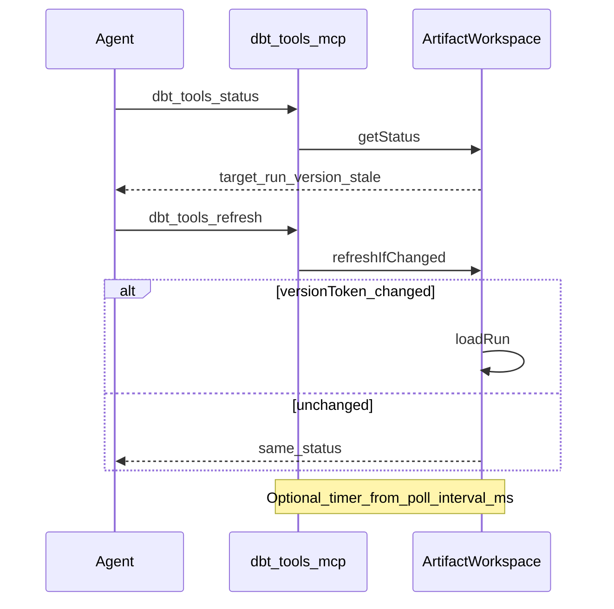

# @dbt-tools/mcp — reference

Operator and agent lookup for `dbt-tools-mcp`. For a short introduction, see [README.md](README.md).

## Command-line interface

```text
Usage: dbt-tools-mcp --dbt-target <path|s3://bucket/prefix|gs://bucket/prefix> [options]
```

| Flag                                        | Required | Environment variable                                          | Description                                                                                                                                                |
| ------------------------------------------- | -------- | ------------------------------------------------------------- | ---------------------------------------------------------------------------------------------------------------------------------------------------------- |
| `--dbt-target <target>`                     | Yes\*    | `DBT_TOOLS_DBT_TARGET`                                        | Local directory, or `s3://bucket/prefix`, or `gs://bucket/prefix`                                                                                          |
| `--poll-interval-ms <ms>`                   | No       | _(none — set in MCP `args` only)_                             | Non-negative integer. If **> 0**, runs a background timer that calls `refreshIfChanged()` on that interval (errors are swallowed). Omit or `0` to disable. |
| `--gcs-project-id <id>`                     | No       | `DBT_TOOLS_GCS_PROJECT_ID`                                    | GCS client project ID (`gs://` targets only)                                                                                                               |
| `--gcs-impersonate-service-account <email>` | No       | `DBT_TOOLS_GCS_IMPERSONATE_SERVICE_ACCOUNT`                   | GCS read-only impersonation principal (`gs://` targets only)                                                                                               |
| `--s3-region <region>`                      | No       | `DBT_TOOLS_S3_REGION` (credentials may also use `AWS_REGION`) | S3 region (`s3://` targets only)                                                                                                                           |
| `--s3-endpoint <url>`                       | No       | `DBT_TOOLS_S3_ENDPOINT`                                       | S3-compatible endpoint URL (`s3://` targets only)                                                                                                          |
| `-h`, `--help`                              | No       | —                                                             | Print usage to **stdout** and exit **0**                                                                                                                   |

CLI flag values override the matching `DBT_TOOLS_*` env vars when both are set. The `--dbt-target` URI always supplies `bucket`, `prefix`, and provider.

\*Required unless **`DBT_TOOLS_DBT_TARGET`** is set to a non-empty value.

Configuration errors print to **stderr** and exit **1** before the MCP server connects.

### Target forms

- **Local:** `./target` or an absolute path (relative paths resolve from the process cwd). Must contain `manifest.json` and `run_results.json` at the directory root.
- **S3:** `s3://my-bucket/dbt/prod` — scheme required; unschemed `bucket/prefix` is treated as a **local** path.
- **GCS:** `gs://my-bucket/dbt/prod` — same strict URI rule as the CLI.

## Environment variables

### Used by MCP

| Variable                                    | Purpose                                                                                                                  |
| ------------------------------------------- | ------------------------------------------------------------------------------------------------------------------------ |
| `DBT_TOOLS_DBT_TARGET`                      | Default artifact root when `--dbt-target` is omitted                                                                     |
| `DBT_TOOLS_GCS_PROJECT_ID`                  | GCS client project (`gs://` targets)                                                                                     |
| `DBT_TOOLS_GCS_IMPERSONATE_SERVICE_ACCOUNT` | GCS impersonation principal (`gs://` targets)                                                                            |
| `DBT_TOOLS_S3_REGION`                       | S3 region (`s3://` targets)                                                                                              |
| `DBT_TOOLS_S3_ENDPOINT`                     | S3-compatible endpoint URL (`s3://` targets)                                                                             |
| `DBT_TOOLS_DEBUG`                           | Set to **`1`** for phased progress logs on **stderr** (GCS/S3 list, download, parse). Safe for MCP; never log to stdout. |
| AWS / GCP standard vars                     | Credentials for remote targets, e.g. `AWS_REGION`, `AWS_ACCESS_KEY_ID`, `AWS_PROFILE`, `GOOGLE_APPLICATION_CREDENTIALS`  |

### Not used by MCP

These apply to other dbt-tools surfaces, not `dbt-tools-mcp`:

| Variable                                          | Used by                                                  |
| ------------------------------------------------- | -------------------------------------------------------- |
| `DBT_TOOLS_TARGET_DIR`                            | Local artifact directory for HTTP/UI workflows (not MCP) |
| `DBT_TOOLS_WEB_BASE_URL`                          | Deep-link base URL (not MCP)                             |
| `DBT_TOOLS_WATCH`, `DBT_TOOLS_RELOAD_DEBOUNCE_MS` | File-watch reload (not MCP)                              |
| `DBT_TARGET_DIR`, `DBT_TARGET`                    | Legacy aliases for target directory                      |

For `s3://` and `gs://` targets, **bucket and prefix come only from the URI** (or `DBT_TOOLS_DBT_TARGET`). Set client options via the env vars above or the matching CLI flags.

Further remote semantics: [ADR-0004](../../docs/adr/0004-remote-object-storage-artifact-sources-and-auto-reload.md). The web app may still use `DBT_TOOLS_REMOTE_SOURCE` JSON; MCP does not.

## MCP client configuration

### Local target

```json
{
  "mcpServers": {
    "dbt-tools": {
      "command": "npx",
      "args": ["-y", "@dbt-tools/mcp", "--dbt-target", "./target"]
    }
  }
}
```

### Remote S3

```json
{
  "mcpServers": {
    "dbt-tools": {
      "command": "npx",
      "args": [
        "-y",
        "@dbt-tools/mcp",
        "--dbt-target",
        "s3://my-bucket/dbt/prod",
        "--poll-interval-ms",
        "30000",
        "--s3-region",
        "ap-northeast-1"
      ],
      "env": {
        "AWS_REGION": "ap-northeast-1"
      }
    }
  }
}
```

### Remote GCS (env vars)

```json
{
  "mcpServers": {
    "dbt-tools": {
      "command": "npx",
      "args": ["-y", "@dbt-tools/mcp", "--dbt-target", "gs://my-bucket/dbt/prod"],
      "env": {
        "DBT_TOOLS_GCS_PROJECT_ID": "my-gcp-project",
        "DBT_TOOLS_GCS_IMPERSONATE_SERVICE_ACCOUNT": "reader@my-gcp-project.iam.gserviceaccount.com",
        "GOOGLE_APPLICATION_CREDENTIALS": "/path/to/key.json"
      }
    }
  }
}
```

### Target via environment only

```json
{
  "mcpServers": {
    "dbt-tools": {
      "command": "npx",
      "args": ["-y", "@dbt-tools/mcp"],
      "env": {
        "DBT_TOOLS_DBT_TARGET": "./target"
      }
    }
  }
}
```

Do not set conflicting values in both `args` and `env`.

## Lifecycle and refresh

On startup the server:

1. Discovers artifact runs at the configured target
2. Requires **exactly one** complete `manifest.json` + `run_results.json` pair
3. Loads that run into memory, then connects MCP over **stdio**

If discovery fails, the process exits before MCP connects.



- **Local run id** is typically **`current`** for a root-level pair under a directory target.
- **`dbt_tools_refresh`** — agent-driven; returns status including `lastRefreshError` when a reload fails (`stale: true` may retain the previous snapshot).
- **`--poll-interval-ms`** — best-effort background refresh; poll failures do not surface to the agent.

### Status payload (`dbt_tools_status` / `dbt_tools_refresh`)

Example shape (fields may be `null` before load):

```json
{
  "target": "./target",
  "selectedRunId": "current",
  "versionToken": "abc123",
  "loadedAtMs": 1710000000000,
  "stale": false
}
```

| Field              | Meaning                                                  |
| ------------------ | -------------------------------------------------------- |
| `target`           | Configured `--dbt-target` / `DBT_TOOLS_DBT_TARGET` value |
| `selectedRunId`    | Active run id                                            |
| `versionToken`     | Changes when underlying artifacts change                 |
| `loadedAtMs`       | When the current snapshot was loaded                     |
| `stale`            | `true` if the last refresh attempt failed                |
| `lastRefreshError` | Present when `stale` is true                             |

## MCP tools reference

All tools return **one JSON object** as MCP text content (`application/json` serialized to a string).

### `dbt_tools_status`

Return the loaded artifact target, selected run, version token, and stale state.

| Input    | Type | Notes |
| -------- | ---- | ----- |
| _(none)_ |      |       |

### `dbt_tools_refresh`

Check artifact metadata and reload the selected run if it changed.

| Input    | Type | Notes                             |
| -------- | ---- | --------------------------------- |
| _(none)_ |      | Returns status shape (see above). |

### `dbt_tools_list_runs`

List the discovered artifact run and its version token (0 or 1 entry).

| Input    | Type | Notes                           |
| -------- | ---- | ------------------------------- |
| _(none)_ |      | Response: `{ "runs": [ ... ] }` |

### `dbt_tools_select_run`

Select and load the discovered artifact run by run id (typically `"current"`).

| Input   | Type             | Notes                       |
| ------- | ---------------- | --------------------------- |
| `runId` | string, required | Must match a discovered run |

### `dbt_tools_search_resources`

Search dbt resources by terms and optional type/package/tag/path filters.

| Input     | Type    | Default / max               |
| --------- | ------- | --------------------------- |
| `query`   | string? | Free-text search            |
| `type`    | string? | Resource type filter        |
| `package` | string? | Package name filter         |
| `tag`     | string? | Tag filter                  |
| `path`    | string? | Path filter                 |
| `limit`   | int?    | Default **20**, max **200** |
| `offset`  | int?    | Default **0**               |

### `dbt_tools_get_resource`

Return details for one dbt resource by `unique_id`.

| Input         | Type             | Default / max                                         |
| ------------- | ---------------- | ----------------------------------------------------- |
| `uniqueId`    | string, required | e.g. `model.my_project.orders`                        |
| `includeCode` | boolean?         | Default **false** — omits compiled/raw SQL when false |

### `dbt_tools_lineage`

Return upstream or downstream dependencies for a dbt resource.

| Input       | Type                       | Default / max          |
| ----------- | -------------------------- | ---------------------- |
| `uniqueId`  | string, required           |                        |
| `direction` | `upstream` \| `downstream` | Default **`upstream`** |
| `depth`     | int ≥ 1?                   | Optional hop limit     |

### `dbt_tools_impact`

Return downstream impact for a dbt resource.

| Input      | Type             | Default / max      |
| ---------- | ---------------- | ------------------ |
| `uniqueId` | string, required |                    |
| `depth`    | int ≥ 1?         | Optional hop limit |

### `dbt_tools_failures`

Return a bounded page of non-successful run result rows.

| Input    | Type    | Default / max               |
| -------- | ------- | --------------------------- |
| `status` | string? | Filter by status            |
| `limit`  | int?    | Default **50**, max **200** |
| `offset` | int?    | Default **0**               |

### `dbt_tools_run_report`

Return a bounded execution summary for the selected artifact run.

| Input                 | Type | Default / max                                     |
| --------------------- | ---- | ------------------------------------------------- |
| `nodeExecutionsLimit` | int? | Default **20**, max **200**                       |
| `offset`              | int? | Default **0** (applies to `node_executions` page) |

## Troubleshooting

| Symptom                                    | Likely cause                                                   | What to do                                                                                                                                          |
| ------------------------------------------ | -------------------------------------------------------------- | --------------------------------------------------------------------------------------------------------------------------------------------------- |
| `dbt artifact target is required`          | No `--dbt-target` and no `DBT_TOOLS_DBT_TARGET`                | Set one in MCP `args` or `env`                                                                                                                      |
| `Expected exactly one artifact set`        | Zero or multiple complete pairs at the target                  | Use a single dbt `target/` root; see [ADR-0004](../../docs/adr/0004-remote-object-storage-artifact-sources-and-auto-reload.md)                      |
| S3/GCS access denied                       | Missing credentials on child process                           | Add AWS/GCP env vars to MCP `env`                                                                                                                   |
| `stale: true`                              | Reload failed after artifact change                            | Call `dbt_tools_refresh`; inspect `lastRefreshError`                                                                                                |
| Inspector **Request timed out** on connect | Client timeout while first artifact load runs (remote targets) | Startup is **lazy** (MCP connects immediately). Raise Inspector `MCP_REQUEST_MAX_TOTAL_TIMEOUT` for the first heavy tool call that loads artifacts. |
| No logs during a long hang                 | Progress only when `DBT_TOOLS_DEBUG=1`                         | `export DBT_TOOLS_DEBUG=1` and read **stderr** (`initialize`, `GCS listObjects`, `loadRun`, …).                                                     |
| MCP transport errors                       | Non-protocol output on stdout                                  | Do not wrap the server with scripts that print to stdout                                                                                            |

## Related documentation

- [README.md](README.md) — quick start and agent workflow
- [ADR-0004](../../docs/adr/0004-remote-object-storage-artifact-sources-and-auto-reload.md) — remote artifact invariants
